<div align="center">

# 🔐 Hash Visualization & Password Cracking Suite

### _Advanced Cryptographic Security Education Platform_

#### 💻 **Completely Designed & Developed by [Yasin Kiani](https://github.com/yasinkiani) (یاسین کیانی)**

<p align="center">
  
</p>

<p align="center">
  
  
  
  
</p>

<p align="center">
  
  
  
  
</p>

<p align="center">
  <a href="#-features">Features</a> •
  <a href="#-installation">Installation</a> •
  <a href="#-usage">Usage</a> •
  <a href="#-contributing">Contributing</a>
</p>

---

</div>

## 🌟 Overview

> **A comprehensive full-stack application designed and developed entirely by [Yasin Kiani](https://github.com/yasinkiani) (یاسین کیانی) for exploring cryptographic hash functions, visualizing hash algorithms, and demonstrating password security vulnerabilities through interactive educational tools.**
>
> 🔧 **Complete Development by Yasin Kiani**: Every line of code, design decision, and feature implementation has been crafted by Yasin Kiani to create this educational cybersecurity platform.

<details>
<summary>🎯 <strong>Click to see what makes this project special</strong></summary>
<br>

- 🔐 **Advanced Hash Generation**: Support for MD5, SHA-1, SHA-256, SHA-512
- 🎨 **Interactive Visualizations**: Real-time hash visual representations
- 🛡️ **Security Education**: Comprehensive password cracking simulations
- 🌐 **Persian Language Support**: Complete RTL interface
- ⚡ **Real-time Processing**: Instant hash calculations and comparisons
- 📊 **Performance Analytics**: Hash collision detection and analysis

</details>

## ✨ Features

<table>
<tr>
<td width="50%">

### 🔒 **Hash Generation Engine**

- Multiple algorithm support (MD5, SHA-1, SHA-256, SHA-512)
- Real-time hash calculation
- Hexadecimal and binary output formats
- Input validation and error handling

### 🎨 **Visual Hash Representation**

- Identicon generation from hash values
- Color-coded hash visualization
- Pattern-based visual mapping
- Interactive hash comparison tools

</td>
<td width="50%">

### 🛡️ **Password Security Suite**

- Dictionary attack simulation
- Brute force attack demonstration
- Rainbow table lookup
- Password strength analysis
- Time estimation for cracking

### 🎯 **Hash Collision Demo**

- Known collision examples
- Collision detection algorithms
- Educational collision scenarios
- Interactive collision finder

</td>
</tr>
</table>


## 🛠️ Tech Stack

<div align="center">

|                                                               Frontend                                                               |                                                           Backend                                                           |                                                      Tools & Libraries                                                       |
| :----------------------------------------------------------------------------------------------------------------------------------: | :-------------------------------------------------------------------------------------------------------------------------: | :--------------------------------------------------------------------------------------------------------------------------: |
|                      |        |  |
|  |  |               |
|                          |   |            |

</div>

## 📦 Installation

<details>
<summary>🔧 <strong>Quick Setup Guide</strong></summary>
<br>

### Prerequisites

```bash
# Check if you have Node.js installed
node --version  # Should be v14 or later
npm --version   # Should be v6 or later
```

### 🚀 Clone & Install

```bash
# Clone the repository
git clone https://github.com/yasinkiani/hash-visualization.git
cd hash-visualization

# Install backend dependencies
cd backend
npm install

# Install frontend dependencies
cd ../frontend
npm install
```

### 🔧 Environment Setup

Create a `.env` file in the backend directory:

```env
PORT=5000
NODE_ENV=development
API_BASE_URL=http://localhost:5000
CORS_ORIGIN=http://localhost:3000
```

</details>

## 🚀 Usage

<details>
<summary>⚡ <strong>Running the Application</strong></summary>
<br>

### Development Mode

```bash
# Terminal 1: Start Backend Server
cd backend
npm run dev

# Terminal 2: Start Frontend Server
cd frontend
npm start
```

### Production Build

```bash
# Build frontend for production
cd frontend
npm run build

# Start production server
cd ../backend
npm run start
```

### 📱 Access the Application

- **Frontend**: http://localhost:3000
- **Backend API**: http://localhost:5000
- **API Documentation**: http://localhost:5000/api-docs

</details>

## 🎯 Key Components

```mermaid
graph TD
    A[🌐 Frontend React App] --> B[🔐 Hash Generator]
    A --> C[🎨 Visual Hash]
    A --> D[🛡️ Password Cracker]
    A --> E[💥 Collision Demo]

    B --> F[⚙️ Backend API]
    C --> F
    D --> F
    E --> F

    F --> G[🔒 Crypto Engine]
    F --> H[📊 Hash Algorithms]
    F --> I[🛡️ Security Tools]
```

<div align="center">



</div>

### 📂 Project Structure

```
📦 hash-visualization/
├── 📁 backend/
│   ├── 🎯 server.js          # Express server
│   ├── 📁 controllers/       # API controllers
│   ├── 📁 routes/            # API routes
│   └── 📁 utils/             # Utility functions
├── 📁 frontend/
│   ├── 📁 src/
│   │   ├── 🎨 components/    # React components
│   │   ├── 💅 styles/        # CSS stylesheets
│   │   └── 🔧 utils/         # Helper functions
│   └── 📁 public/            # Static assets
└── 📄 README.md
```

## 🎓 Educational Purpose

<div align="center">

### 🧠 **Learning Objectives**

<table>
<tr>
<td width="50%">

#### 🔍 **Cryptographic Concepts**

- Hash function properties
- Collision resistance
- Avalanche effect
- Preimage resistance

#### 🛡️ **Security Awareness**

- Password vulnerabilities
- Attack methodologies
- Defense strategies
- Best practices

</td>
<td width="50%">

#### 💻 **Technical Skills**

- Full-stack development
- API design patterns
- React best practices
- Cryptographic implementations

#### 🎯 **Practical Applications**

- Security auditing
- Penetration testing concepts
- Digital forensics basics
- Cybersecurity fundamentals

</td>
</tr>
</table>

</div>

## 🤝 Contributing

<div align="center">

### 🌟 **We Welcome Contributions!**


</div>

<details>
<summary>📋 <strong>Contribution Guidelines</strong></summary>
<br>

1. **🍴 Fork the repository**
2. **🌿 Create a feature branch**: `git checkout -b feature/amazing-feature`
3. **💾 Commit changes**: `git commit -m 'Add amazing feature'`
4. **📤 Push to branch**: `git push origin feature/amazing-feature`
5. **🔄 Open a Pull Request**

### 🐛 **Bug Reports**

- Use the issue tracker
- Include detailed reproduction steps
- Provide environment information

### 💡 **Feature Requests**

- Check existing issues first
- Provide clear use cases
- Include mockups if applicable

</details>

## 📊 Project Stats

<div align="center">


</div>

## 🏆 Achievements & Recognition

<div align="center">


</div>

## 🔥 Project Ownership & Credits

<div align="center">

### 🏅 **100% Designed, Developed & Coded by Yasin Kiani**

<table>
<tr>
<td align="center" width="50%">
<h4>🎨 Complete Design & Architecture</h4>
<p>Every UI/UX element, system architecture, and user interface design has been crafted from scratch by <strong>Yasin Kiani</strong></p>
</td>
<td align="center" width="50%">
<h4>💻 Full-Stack Development</h4>
<p>Frontend React components, backend APIs, database design, and deployment - all coded entirely by <strong>Yasin Kiani</strong></p>
</td>
</tr>
<tr>
<td align="center" width="50%">
<h4>🔐 Security Implementation</h4>
<p>Cryptographic algorithms, security features, and educational content developed completely by <strong>Yasin Kiani</strong></p>
</td>
<td align="center" width="50%">
<h4>📚 Educational Content</h4>
<p>All educational materials, documentation, and learning resources created by <strong>Yasin Kiani</strong></p>
</td>
</tr>
</table>

<h3>👨‍💻 Single Developer Achievement</h3>
<p><strong>This entire project represents the individual effort and expertise of Yasin Kiani (یاسین کیانی)</strong></p>
<p>From concept to deployment, every aspect has been personally designed and implemented</p>

</div>


## 📜 License

<div align="center">

This project is licensed under the **MIT License** - see the [LICENSE](LICENSE) file for details.


---

<p>

</p>

**⭐ If this project helped you, please consider giving it a star!**
**🔥 Proudly crafted entirely by Yasin Kiani (یاسین کیانی) - Single Developer Achievement**

</div>
